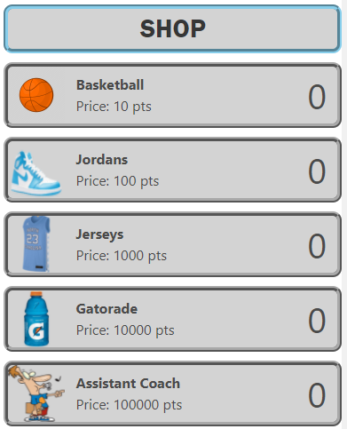
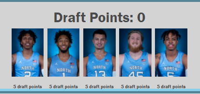
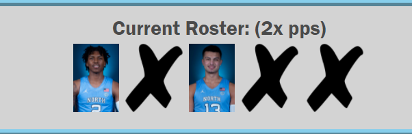

# a99 UNCClicker

Hello! Welcome to our final project, UNCClicker! In this incremental game, you take on the role of a new UNC Basketball coach, ready to build their team and defeat the opposing ACC teams. Buy different practice equipment to gain points which you can use to level up your teams stats. Every 10:00 minutes, your team will be pitted against another ACC team with similar stats as yours. Wins and losses are recorded, and depending on how hard you beat the opposing team you can earn draft points to draft current UNC Basketball players for permanent bonuses!

## Our Team Members
1. Front end lead: Ellis Kay (smelliskay)
2. Back end lead: Wesley Lemons (wlemons1)
3. Design lead: Jason Chay (jnchay)
4. Database lead: Justin Adams (jmadams3)
5. jboy953

## How to play

The general premise works like any other incremental game. Click the UNC Logo to get points, and start buying things in the shop to increase your points per second.

## The Shop and the Level Shop

Here you can purchase different practice equipment, with each item getting more expensive the more you purchase. They give you increasingly more points per second. The level shop operates similarly, although the different stats dont directly give you more points per second.

## Match System

In the top left you will notice your teams record, the amount of time until the next match, and the Logo of the team you will be playing. The ACC team you are playing has randomized stats which are proportional to what your teams stats are. If at least 3 our of 5 of your stats are higher than your opponent's stats, then you win and obtain draft points proportional to how many stats of yours were higher than your opponent's.

## Draft Points

On the bottom left of your screen is the player shop, which you use draft points you get from winning matches to purchase the current UNC basketball lineup. In the future, more UNC players of past and present will be added with different bonuses.

## Roster System

On the bottom right of your screen is your current roster. You have 5 slots for players to be in your starting lineup. Currently, every player you purchase increases your total pps by 50%, but in the future different players may give you different bonuses. Try to fill out your roster to maximize your pps!

# How It Works - Front End

The front end is split up between a couple different js files: countdown.js, saving.js, teamsimulation.js, and main.js.

For a breakdown of what is happening in main, click [here](./docs/main.md).

To understand the countdown timer, click [here](./docs/countdown.md)

For more on the team system, click here [here](./docs/teamsimulation.md)

# How It Works - Back End

Fill in documentation for the backend.

The back end is split up between a few different js files: server.js, login_database.js, stats_database.js, login.js, and signup.js.

For a breakdown of how the server.js file works, click [here](./docs/server.md).

For a breakdown of how the databases work, click [here](./docs/databases.md).